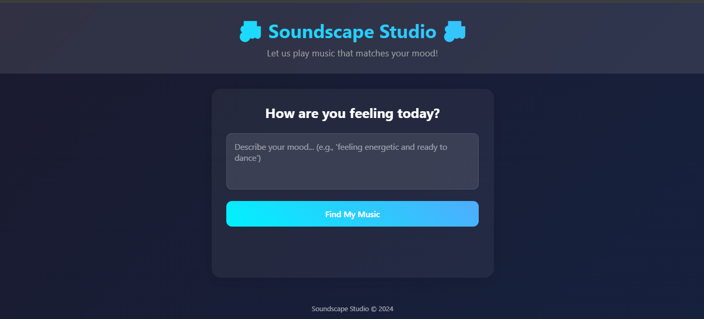

# Soundscape Studio 🎶

Experience music that matches your mood. Soundscape Studio is an elegant web application integrated with custom AI Model that creates personalized music recommendations based on your emotional state.

## ✨ Features

- **AI-Powered Music Selection**: Advanced emotion analysis model to understand your mood
- **Smart Recommendations**: Intelligent matching of music to emotional states
- **Clean Interface**: Minimalist design focused on user experience
- **Instant Playback**: Stream music directly in your browser
- **Responsive Design**: Seamless experience across all devices

## 🚀 Quick Start

1. **Clone the repository**
```bash
git clone https://github.com/arjamand/Soundscape-Studio
cd soundscape-studio
```

2. **Install dependencies**
```bash
python -m pip install -r requirements.txt
```

3. **Run the application**
```bash
python app.py
```

Visit `http://localhost:5000` in your browser.

## 📁 Project Structure

```
soundscape-studio/
├── app.py              # Flask application
├── model/              # AI emotion analysis model directory
├── static/
│   ├── audio/          # Music files categorized by emotion
│   │   ├── calm/
│   │   ├── energetic/
│   │   └── relaxed/
│   └── css/            # Styling
└── templates/          # HTML templates
```

## 🔧 Technology Stack

- **Frontend**: HTML5, CSS3, JavaScript
- **Backend**: Python, Flask
- **AI Model**: Custom emotion classification model
- **Audio**: HTML5 Audio API
- **Design**: CSS Grid, Flexbox, Animations

## 🎵 Adding Music

Place your audio files in the appropriate mood directory under `static/audio/`:
- `calm/` - For peaceful, tranquil music
- `energetic/` - For upbeat, dynamic tracks
- `relaxed/` - For gentle, soothing melodies

## 📝 License

MIT License - feel free to use this project however you'd like!

## 🤝 Contributing

Contributions are welcome! Feel free to:
1. Fork the repository
2. Create a feature branch
3. Submit a pull request

## 💡 Future Plans

- Enhanced AI emotion detection
- Personalized learning from user feedback
- Extended mood categories
- Playlist generation
- Music upload functionality

---

Made with ❤️ for music lovers and AI enthusiasts